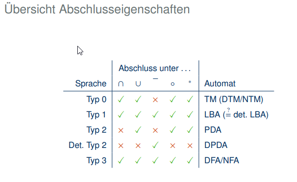
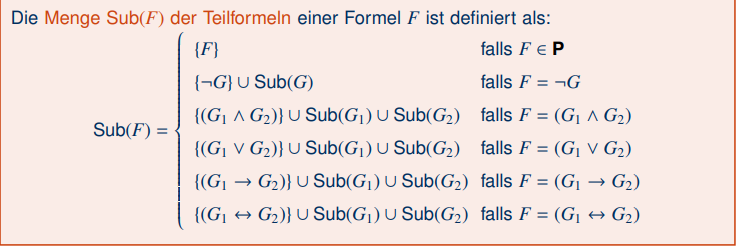

## 
 Rechnerregeln

- L1/L2 = L1 intersect !L2
  

----
## 
 Grammatiken

- **Satz**: Es gibt *abzählbar* viele Wörter über jedem Alphabet Σ. Jede Sprache ist also entweder endlich oder abzählbar unendlich.
- Eine Menge M ist abzählbar gdw. es eine injektive Funktion f : M → N gibt
- **Satz**: Es gibt *überabzählbar*  viele Sprachen über jedem beliebigen Alphabet Σ
- Die Menge der DFAs ist abzahlbar
-  Die Kardinalität der Potenzmenge ist immer größer als die der Menge selbst
  
- Eine Grammatik G ist ein 4-Tupel G = hV, Σ, P, Si bestehend aus:
  - V eine Menge von Variablennamen,
  - Σ ein Alphabet, disjunkt zu V (d.h., Σ ∩ V = ∅),
  - P eine Menge von Produktionsregeln der Form w → v für beliebige Wörter w und
v über Σ ∪ V, wobei w mindestens eine Variable enthält (d.h. w, v ∈ (Σ ∪ V)∗ und w !∈ Σ∗),
  - S eine Startvariable aus V (d.h. S ∈ V).
Die Elemente von Σ nennt man auch Terminalsymbole, die Elemente von V analog
Nichtterminalsymbole.
---
- Eine Grammatik G = hV, Σ, P, Si ist genau dann von Typ 1 (kontextsensitiv), wenn eine
der folgenden Bedingungen gilt:
 - 1) Alle Regeln w → v erfüllen die Bedingung |w| ≤ |v| (ursprüngliche Definition).
 - 2) Es gibt eine Regel S → e und alle anderen Regeln w → v erfüllen zwei
Bedingungen:
    - a) |w| ≤ |v| (insbesondere ist also v , e);
    - b) S kommt nicht in v vor.
(Sonderfall mit einer einzelnen e-Regel.)
  
- Eine kontextfreie Grammatik G = hV, Σ, P, Si ist e-frei, wenn eine der folgenden Bedingungen gilt:
    - 1) Es gibt keine Regel der Form A → e
    - 2) Es gibt eine Regel S →e und bei allen anderen Regeln A → v ist v , e und S
kommt nicht in v vor.

e-freie kontextfreie Grammatiken erzeugen die gleichen
Sprachen wie kontextfreie Grammatiken allgemein

---

## 
 DFA, NFA

Ein deterministischer endlicher Automat (international: „DFA“, deterministic finite automaton) M ist ein Tupel M = hQ, Σ, δ, q0, Fi mit den folgenden Bestandteilen:
- Q: endliche Menge von Zuständen
- Σ: Alphabet
- δ: Übergangsfunktion, eine partielle∗ Funktion Q × Σ → Q
- q0: Startzustand q0 ∈ Q
- F: Menge von Endzuständen F ⊆ Q

**Satz**: Mtotal = (Q`, Σ, δ`, q0, F) hat eine totale Übergangsfunktion und akzeptiert die selbe Sprache wie M, d.h. L(Mtotal) = L(M).

**Satz**: Die Klasse der Sprachen, die durch einen DFA erkannt werden können, ist genau die Klasse der regulären Sprachen.

Ein **nichtdeterministischer** endlicher Automat (international: „NFA“) M ist ein Tupel
M = hQ, Σ, δ, Q0, Fi mit folgenden Bestandteilen:
- Q: endliche Menge von Zuständen,
- Σ: Alphabet,
- δ: Übergangsfunktion, eine totale Funktion Q × Σ → 2^Q, wobei 2^Q die
Potenzmenge von Q ist;
- Q0: Menge möglicher Startzustände Q0 ⊆ Q,
- F: Menge von Endzuständen F ⊆ Q
---
- Ein DFA hat genau einen Lauf für jedes Wort.
Er akzeptiert, wenn dieser Lauf akzeptierend ist.
- Ein NFA kann für ein Wort mehrere Läufe haben.
Er akzeptiert, wenn einer dieser Läufe akzeptierend ist.
- Die Sprache eines NFA M = hQ, Σ, δ, Q0, Fi ist die Menge aller Wörter w ∈Σ∗, für die M einen akzeptierenden Lauf hat.
- Die Sprache eines NFA M = hQ, Σ, δ, Q0, Fi ist L(M) = {w ∈ Σ∗
| δ(Q0, w) ∩ F != ∅}
- Ein endlicher Automat M ist genau dann äquivalent zu einem endlichen Automaten M0, wenn L(M) = L(M0) gilt
- Jeder DFA kann als NFA aufgefasst werden. Daher wird jede von einem DFA
akzeptierbare Sprache auch von einen NFA akzeptiert.
- **Satz**: Jede von einem NFA akzeptierbare Sprache wird auch von einen DFA akzeptiert
- **Satz**: Die Klasse der Sprachen, die durch DFAs oder NFAs erkannt werden können,ist genau die Klasse der regulären Sprachen
- NFA mit Wortübergangen: Die Sprache solcher Automaten wird wie bei NFAs definiert, nur dass in einem Schritt
beliebige Wörter gelesen werden können.
- **Satz**: Jede von einem NFA mit Wortübergängen akzeptierte Sprache wird auch von einem „normalen“ NFA akzeptiert.

### E-NFA Variationen
- Die Konstruktion im Beweis „verlängert“ normale Übergänge „nach rechts“ durch Anhängen von e-Transitionen.
- Verlängerung nach links“:e-Transitionen vor normalen Übergängen;
Anfangszustände werden beibehalten; dafür werden Endzustände mit
e-Transitionen erweitert.
----
### Abschluss eigenschaften
- Schnitt: Akzeptiere genau dann, wenn beide Automaten akzeptieren (Produktautomat, alle mögliche Paare Q1 × Q2, Σ, δ, Q0,1 × Q0,2, F1 × F2)
  - Satz: L(M1 ⊗ M2) = L(M1) ∩ L(M2).
- Vereinigung: akzeptiere wenn einer der Automaten akzeptiert
  - Satz: L(M1 ⊕ M2) = L(M1) ∪ L(M2).
- Komplement
  - **Satz**: Für jeden DFA M mit **totaler Übergangsfunktion** gilt L(!M) = !L(M).
  - Auch NFAs dürfen nicht direkt komplementiert werden:
- Konkatenation
  - Wir können Automaten „hintereinander hängen“, indem wir von Endzuständen des
ersten zu Startzuständen des zweiten wechseln.
  - Satz: Für alle NFA M1 und M2 gilt L(M1  M2) = L(M1) ◦ L(M2).
- Kleene-Stern
  - Der Kleene-Stern ist eine verallgemeinerte Konkatenation, bei der ein Automat
rekursiv hinter sich selbst „gehängt“ wird.
  - Satz: L(M∗) = L(M)∗
  
Der Vereinigungsautomat ist immer ein NFA

----

## 
 Reguläre Ausdrücke

**Satz**: Jede endliche Sprache ist regulär

**Satz**: Alle regulären Sprachen können durch Anwendung von ∪, ◦ und ∗ aus endlichen Sprachen konstruiert werden

Zwei reguläre Ausdrücke α und β sind genau dann äquivalent, in Symbolen α ≡ β, wenn L(α) = L(β).
  - ∅∗ ≡ e
  - e* = e

Eine Sprache L ist genau dann regulär, wenn es einen regulären
Ausdruck α gibt, für den L(α) = L gilt.
  -  Für jeden regulären Ausdruck α gibt es einen NFA M, so dass L(α) = L(M)
  -  Für jeden NFA M gibt es einen regulären Ausdruck α, so dass L(α) = L(M)

Regel von Arden: Aus α ≡ βα | γ mit e not aus L(β) folgt α ≡ β∗γ.

## 
 Minimal Automaten

- Unterschiedliche Äquivalenzklassen sind disjunkt:
- Für einen DFA M = (Q, Σ, δ, q0, Fi) mit totaler Übergangsfunktion ist der
Quotientenautomat M/∼ gegeben durch M/∼ = (Q/∼, Σ, δ∼, [q0]∼M , F/∼), wobei gilt:
  - Q/∼ = {[q]∼ | q ∈ Q}
  - δ∼([q]∼, a) = [δ(q, a)]∼
  - F/∼ = {[q]∼ | q ∈ F}
- **Satz**: Für jeden totalen DFA M gilt L(M) = L(M/∼)
  - (1) Aus q1 ∼ q2 folgt stets: q1 ∈ F gdw. q2 ∈ F.
  - (2) Wenn q1 ∼ q2, dann auch δ(q1, a) ∼ δ(q2, a).
  - (1) Aus q1 ∈ F und q2 < F folgt immer q1 / q2.
  - (2) Wenn δ(q1, a) / δ(q2, a), dann q1 / q2.

- Zwei Zustände p, q ∈ Q sind M-äquivalent, in Symbolen p ∼M q,wenn gilt:
  - L(Mp) = L(Mq) das heißt wenn für jedes Wort w ∈ Σ∗ gilt:
  - δ(p, w) ∈ F genau dann wenn δ(q, w) ∈ F.

Sei M ein DFA mit totaler Übergangsfunktion. Der **reduzierte** Automat Mr ergibt sich durch folgende Schritte (minimalen DFA):
- (1) Entferne alle unerreichbaren Zustände aus M.
- (2) Berechne den Quotientenautomaten.

**Satz**: Alle minimalen DFA mit totaler Übergangsfunktion, die L(M) erkennen, sind bis auf Umbenennung von Zuständen gleich (sie sind isomorph). Daher hängt Mr nur von L(M) ab, nicht von M.

Für eine Sprache L ⊆ Σ∗ ist die Nerode-Rechtskongruenz 'L wie folgt definiert:

    Für Wörter u, v ∈ Σ∗ sei u ~ v genau dann, wenn gilt:
    Für alle w ∈ Σ∗ gilt: uw ∈ L genau dann, wenn vw ∈ L

Definition (kurz): u ~ v gdw. für alle w ∈ Σ∗ gilt: uw ∈ L gdw. vw ∈ L.

**Satz (Myhill & Nerode)**: Eine Sprache L ist genau dann regulär, wenn L endlich viele Äquivalenzklassen hat.

**Satz**: M( Myhill-Nerode-Minimalautomat) hat unter allen totalen DFAs, die L erkennen, eine minimale Anzahl an Zuständen.

Ein Isomorphismus zwischen zwei DFAs M1 = (Q1, Σ, δ1, q1, F1) und
M2 = (Q2, Σ, δ2, q2, F2) ist eine bijektive Funktion f : Q1 → Q2, so dass gilt:
- f(q1) = q2
- f(δ1(q, a)) = δ2(f(q), a) für alle a ∈ Σ
- {f(q) | q ∈ F1} = F2
Zwei Automaten sind isomorph, wenn es einen Isomorphismus zwischen ihnen gibt.

**Satz**: Ist L eine reguläre Sprache, M ein DFA mit totaler Übergangsfunktion und L(M) = L, so sind der reduzierte Automat Mr und der Myhill-Nerode-Minimalautomat ML isomorph.
  - also ML ist isomorph zu jedem reduzierten Automaten für L.

### Testen ob 2 Automaten gleiche Sprache erzeugen
  - Transformiere M1 und M2 falls nötig in DFAs mit totaler Übergangsfunktion
  - Bestimme die reduzierten Automaten
  -  Teste, ob die reduzierten Automaten isomorph sind (z.B. naiv durch
systematisches Durchprobieren aller Bijektionen)

## 
 Pumping Lemma, Abschlusseigenschaften

**Satz**: Wenn L1 und L2 regulär sind, dann auch L1 ∩ L2, L1 ∪ L2, L∗1 und !L1.
- **Satz**: Wenn L1 regulär und L1 ∩ L2 nicht regulär ist, dann ist L2 ebenfalls nicht regulär.
- **Satz (Pumping-Lemma)**: Für jede reguläre Sprache L
gibt es eine Zahl n ≥ 0, so dass gilt:
für jedes Wort z ∈ L mit |z| ≥ n
gibt es eine Zerlegung z = uvw mit |v| ≥ 1 und |uv| ≤ n, so dass:
für jede Zahl k ≥ 0 gilt: uv^(k)w ∈ L
- Für endliche Sprachen ist die Eigenschaft trivial. Man wählt n einfach so
groß, dass es keine Wörter z mit |z| ≥ n gibt, für welche weitere Eigenschaften gefordert werden.

---
- Fur eine Sprache gibt es unterschiedliche Grammatiken, die haben unterschiedliche Ableitungsbäume. 

- Kettenregeln - nicht gunstig. Variable durch eine andere ersetzen. Führt nicht zu einer Verbreitung des Baumes, man verlängert nur die Ableitung und macht Pfade im Baum schmaller, wo jedes Knoten genau 1 Kindknoten hat.

- In CNF keine Kettenregeln gibt, bei Ableitung immer etwas herausbekommen
- CNF: A->AB oder A->a
### Abschluss kontextfreie Sprachen
- Vereiningung +
- Konkatenation +
- Stern +
- Schnitt -
- Komplement -
  
Wenn G kontextfrei ist, dann ist G* kontextfrei 
Wenn G1 G2 kontextfrei sind, dann G1 oder G2 kontextfrei ist
Wenn L1 und L2 kontextfrei sind, dann L1 und L2 nicht immer kontextfrei

---
**Satz (Pumping-Lemma)**:
Für jede kontextfreie Sprache L gibt es eine Zahl n ≥ 0, so dass gilt:
- für jedes Wort z ∈ L mit |z| ≥ n
- gibt es eine Zerlegung z = uvwxy mit |vx| ≥ 1 und |vwx| ≤ n, so dass:
- für jede Zahl k ≥ 0 gilt: **uv^(k)wx^(k)y ∈ L**.

---

## 
 Kellerautomat

- Ein Kellerautomat (international: „PDA“, „Pushdown Automaton“) M ist ein Tupel M = (Q, Σ, Γ, δ, Q0, F) mit den folgenden Bestandteilen:
  - Q: endliche Menge von Zuständen
  - Σ: Eingabealphabet
  - Γ: Kelleralphabet
  - δ: Übergangsfunktion, eine totale Funktion Q × Σe × Γe → 2^Q×Γe, wobei 2^Q×Γe die Potenzmenge von Q × Γe ist.
  - Q0: Menge möglicher Startzustände Q0 ⊆ Q
  - F: Menge von Endzuständen F ⊆ Q

- Die von M akzeptierte Sprache L(M) ist die Menge aller von M akzeptierten Wörter
- **Satz**: Eine Sprache ist genau dann kontextfrei, wenn sie von einem PDA akzeptiert wird
- **Fakt**: Vq,r erzeugt ein Wort w genau dann, wenn P von q mit leerem Keller zu r mit
leerem Keller gelangen kann.

---
## 
 Determenistisch Kontextfreie Sprachen
- Ein deterministischer Kellerautomat (international: „DPDA“) M ist ein Tupel M = (Q, Σ, Γ, δ, q0, F) mit den folgenden Bestandteilen:
  - Q: endliche Menge von Zuständen
  - Σ: Eingabealphabet
  - Γ: Kelleralphabet
  - δ: Übergangsfunktion, eine partielle Funktion Q × Σ × Γ → Q × Γ,
    - so dass für alle q ∈ Q, a ∈ Σ und A ∈ Γ
    - jeweils nur eines der folgenden definiert ist:
  δ(q, a, A) δ(q, a,e) δ(q,e, A) δ(q,e,e)
  - q0: ein Startzustand q0 ∈ Q
  - F: Menge von Endzuständen F ⊆ Q

Es gibt verschiedene Quellen für Nichtdeterminismus bei PDAs:
- Die Übergangsfunktion liefert eine Menge möglicher Übergänge.
- Es gibt mehrere mögliche Startzustände.
- Es gibt e-Übergänge im Bezug auf Eingabe und Keller.
---

- Eine Sprache ist genau dann deterministisch kontextfrei, wenn sie durch einen deterministischen Kellerautomaten akzeptiert wird.
- Satz: Die deterministisch kontextfreien Sprachen bilden eine echte Untermenge der kontextfreien Sprachen.
- Satz: Die Klasse der deterministisch kontextfreien Sprachen ist unter Komplement abgeschlossen
- Eine Grammatik G ist genau dann **mehrdeutig**, wenn es ein Wort w ∈ L(G) gibt, das mehrere Syntaxbäume zulässt (äquivalent: wenn es für w mehrere unterschiedliche Linksableitungen gibt).
- *Deterministische Sprachen haben immer auch eindeutige Grammatiken*.
(Allerdings womöglich nicht ausschließlich solche.)
  - Aber: Eindeutige Grammatiken können nichtdeterministische Typ-2-Sprachen
beschreiben
  - deterministisch <= eindeutig <= Typ 2

-  DPDAs erkennen im Prinzip dieselben Sprachen wie DCFGs
-  **Satz**: Deterministische Typ-2-Sprachen sind *nicht* unter Schnitt abgeschlossen.
-  **Satz**: Deterministische Typ-2-Sprachen sind *nicht* unter Vereinigung abgeschlossen.
   -  Beweis: Angenommen, sie wären unter Vereinigung abgeschlossen, dann wären sie
  (mittels der Regeln von De Morgan) auch unter Schnitt abgeschlossen, da sie bereits
  unter Komplement abgeschlossen sind. Widerspruch
-  **Lemma**: Ist L1 deterministisch kontextfrei und L2 regulär, so ist L1 ∩ L2 deterministisch kontextfrei
- **Satz**: Deterministische Typ-2-Sprachen sind *nicht* unter Konkatenation abgeschlossen
- **Satz:** Deterministische Typ-2-Sprachen sind *nicht* unter Kleene-Stern abgeschlossen.
- Zusammenfassung: Deterministische Typ-2-Sprachen sind abgeschlossen unter
Komplement, aber nicht unter Vereinigung, Schnitt, Konkatenation oder Kleene-Stern.
---
## 
 Entscheidbarkeit und TM

- Die Haupteinschränkung von Kellerautomaten war das eingeschränkte Speichermodell
---
TMs haben eine endliche Steuerung (wie bei NFA und PDA).
- Es gibt eine unbeschränkte Menge an Speicher (wie bei PDA).
- Die TM kann in jedem Schritt ein Zeichen aus dem Speicher lesen und eines
schreiben (wie bei PDA).
- Der Lese-/Schreibzugriff ist an jeder beliebigen Speicheradresse möglich
(im Gegensatz zu PDA).
Zur praktischen Implementierung speichert die TM die aktuelle Adresse und kann
diese in jedem Schritt um eins erhöhen oder verringern.
- Zur Vereinfachung wird die Eingabe einfach beim Start in den Speicher übergeben,
so dass „Lesen der Eingabe“ und „Lesen des Speichers“ die selbe Operation sind.
- Am linken Rand kann der Kopf nicht weiter nach links bewegt werden.
- Am rechten Rand des Speichers kann der Kopf nach rechts bewegt werden: Dann
wird dort eine neue Speicherzelle mit dem Inhalt __ (Leerzeichen, Blank) angefügt.

Eine **(deterministische) Turingmaschine (DTM)** ist ein Tupel M = (Q, Σ, Γ, δ, q0, F) mit
den folgenden Bestandteilen:
- Q: endliche Menge von Zuständen
- Σ: Eingabealphabet
- Γ: Arbeitsalphabet mit Γ ⊇ Σ ∪ {__}
- δ: Übergangsfunktion, eine partielle Funktion
Q × Γ → Q × Γ × {L, R, N}
- q0: Startzustand q0 ∈ Q
- F: Menge von akzeptierenden Endzuständen F ⊆ Q
  - Dabei bedeutet δ(q, a) = hp, b, Di:
„Liest die TM in Zustand q unter dem Lese-/Schreibkopf ein a,
dann wechselt sie zu Zustand p, überschreibt das a mit b
und verschiebt den Lese-/Schreibkopf gemäß D ∈ {L, R, N}
(nach links, nach rechts, gar nicht).“
---
- Ein Lauf ist eine maximale Folge von Konfigurationen, die durch die Übergangsrelation
in Beziehung stehen.
- Ein Lauf kann endlich sein, wenn es für die Schlusskonfiguration keinen
Nachfolger gibt.
- Ein Lauf kann unendlich sein, wenn immer neue Konfigurationen erreichbar sind.
- Die TM akzeptiert die Eingabe, wenn der (eindeutig bestimmte) Lauf, der mit q0 w
beginnt, endlich ist und seine letzte Konfiguration einen Endzustand beinhaltet.
- Andernfalls verwirft die TM die Eingabe.
- Es gibt zwei Gründe für die Nichtakzeptanz von Wörtern:
   - (1) Die TM hält in einem Zustand, der kein Endzustand ist.
   - (2) Die TM hält nicht (Endlosschleife).

**Die von einer TM M erkannte Sprache L(M) ist die Menge aller Wörter, die von M akzeptiert werden.**  
**Eine TM ist ein Entscheider, wenn sie bei jeder Eingabe hält. Wir sagen in diesem Fall, dass die TM die von ihr erkannte Sprache entscheidet**

- Church-Turing-These: Eine Funktion ist genau dann im intuitiven Sinne berechenbar,
wenn es eine Turingmaschine gibt, die für jede mögliche Eingabe den Wert der Funktion auf das Band schreibt und anschließend hält
- Ein DFA kann als DTM aufgefasst werden, welche die Eingabe auf dem Band nur in einer Richtung liest und niemals beschreibt.
- Ein deterministischer PDA kann leicht durch eine 2-Band-TM simuliert werden. Dabei wird vom ersten Band nur gelesen, während auf dem zweiten Band der
aktuelle Kellerinhalt gespeichert wird.
- Satz: Für jedes k ≥ 1 können k-Band-TM durch (1-Band-)TM simuliert werden.

## 
 Nichtdeterministiche TM (NTM)

- Die nichtdeterministische Turingmaschine (NTM)
  - modelliert die Übergangsfunktion als totale Funktion δ : Q × Γ → 2^(Q×Γ×{L,R,N}),
  - wobei 2^(Q×Γ×{L,R,N}) die Potenzmenge von Q × Γ × {L, R, N} ist;
  - kann weiterhin mit einem einzigen Anfangszustand arbeiten.
- Läufe werden wie bei DTMs definiert, aber jetzt kann es pro Eingabe viele Läufe geben.
- Die Eingabe wird genau dann akzeptiert, wenn mindestens ein Lauf endlich ist und in
einer akzeptierenden Konfiguration endet.
- **Satz**: Jede NTM kann von einer DTM simuliert werden
- **Satz**: Jede Sprache die von einer NTM entschieden wird, kann auch von einer DTM entschieden werden.
  
## 
 Entscheidbarkeit

Eine Sprache L heißt genau dann **entscheidbar (berechenbar, rekursiv)**, wenn
- es eine TM M gibt, die ihr Wortproblem entscheidet, d.h. M ist Entscheider und L = L(M).
- Andernfalls heißt L unentscheidbar.
  
L heißt genau dann **semi-entscheidbar** (Turing-erkennbar, rekursiv aufzählbar), wenn es eine TM M mit L = L(M) gibt (auch wenn M kein Entscheider ist).

**Satz**: Es gibt abzählbar viele Turingmaschinen (Computerprogramme, Algorithmen)
aber überabzählbar viele Sprachen. Also sind die meisten Sprachen unentscheidbar.

Das Halteproblem besteht in der folgenden Frage:
Gegeben eine TM M und ein Wort w, wird M für die Eingabe w jemals anhalten?
  - Das Halteproblem ist das Wortproblem für die Sprache
{enc(M)##enc(w) | M hält bei Eingabe w}.

**Satz**: Das Halteproblem ist unentscheidbar.

**Satz**: Das Halteproblem ist semi-entscheidbar.

**Satz**: Das Komplement des Halteproblems ist nicht Turing-erkennbar (nicht entscheidbar).

Ein Formalismus ist Turing-mächtig, wenn er das Ein-/Ausgabe-Verhalten jeder TuringMaschine simulieren kann (äquivalent: wenn er eine UTM kodieren kann).

---

### Universelle TM
- **Satz**: Es gibt eine Turingmaschine U, die für Eingaben der Form enc(M)##enc(w)
das Verhalten von M auf w simuliert:
  - Falls M auf w hält, dann hält U auf enc(M)##enc(w) mit dem gleichen Ergebnis
  - Falls M auf w nicht hält, dann hält U auf enc(M)##enc(w) ebenfalls nicht
  
- **Satz von Rice** (formell): Sei E eine Eigenschaft von Sprachen, die für manche
Turing-erkennbare Sprachen gilt und für manche Turing-erkennbare Sprachen nicht gilt (eine „nichttriviale Eigenschaft“). Dann ist das folgende Problem unentscheidbar:
- Eingabe: Turingmaschine M
- Ausgabe: Hat L(M) die Eigenschaft E?
---
- **Satz**: Die Typ-0-Grammatiken erzeugen genau diejenigen Sprachen, die von einer Turingmaschine erkannt werden können.
  - Typ-0-Grammatiken sind ein universelles (Turing-mächtiges) Berechnungsmodell.
  - Typ-0-Sprachen sind die größte Klasse von Sprachen, die wir mit einem
  „implementierbaren“ Formalismus beschreiben können.
  - Die Typ-0-Sprachen sind genau die semi-entscheidbaren Sprachen.
  - Das Wortproblem für Typ-0-Sprachen ist unentscheidbar.

Ein **linear beschränkte Turingmaschine** (linear bounded automaton, LBA) ist eine nichtdeterministische Turingmaschine, die den Lese-/Schreibkopf nicht über das letzte Eingabezeichen hinaus bewegen kann. Versucht sie das, so bleibt der Kopf stattdessen an der letzten Bandstelle stehen.

**Satz:** Die Typ-1-Grammatiken erzeugen genau diejenigen Sprachen, die von einem
LBA erkannt werden können.

**Satz**: Das Wortproblem für Typ-1-Sprachen ist entscheidbar.

Beispiel: Das Halteproblem ist keine Typ-1-Sprache, da es nicht entscheidbar ist.

## 
 Abschlusseigenschaften

---

# 
 Logic

- Atome an sich bedeuten zunächst nichts; sie können einfach wahr oder falsch sein.
- Je nachdem, welche Atome wahr sind und welche falsch, ergeben sich
verschiedene „Interpretationen“, dargestellt durch Wertzuweisungen.
(Funktionen von P nach {1, 0}; 1 entspricht „wahr“ und 0 entspricht „falsch“).
- Die Wahrheit (oder Falschheit) einer Formel ergibt sich (ausschließlich!) aus den
Wahrheitswerten der in ihr vorkommenden Atome.
-> Wertzuweisungen machen Formeln wahr oder falsch.
- Die Bedeutung einer Formel besteht darin, dass sie uns Informationen darüber liefert,
welche Wertzuweisungen möglich sind, falls die Formel wahr sein soll
---
Eine Wertzuweisung w erfüllt genau dann eine Formel F, in Symbolen w |= F, wenn
eine der folgenden induktiv definierten Bedingungen gilt:
- F ∈ P mit w(F) = 1,
- F = ¬G mit w not|= G,
- F = (G1 ∧ G2) mit w |= G1 und w |= G2,
- F = (G1 ∨ G2) mit w |= G1 oder w |= G2 (oder beides),
- F = (G1 → G2) mit w 6|= G1 oder w |= G2,
- F = (G1 ↔ G2) mit: w |= G1 genau dann, wenn w |= G2.

 

Eine Wertzuweisung w ist genau dann ein Modell einer Formel F, wenn w |= F (also
wenn w(F) = 1) gilt. Ist F eine (möglicherweise unendliche) Menge von Formeln, dann
ist w genau dann ein Modell der Menge F , wenn w |= F für alle F ∈ F gilt. In diesem
Fall schreiben wir w |= F

Sei F eine Menge von Formeln. Eine Formel G ist genau dann eine
logische Konsequenz aus F , wenn jedes Modell von F auch ein Modell von G ist.
In diesem Fall schreiben wir F |= G.

- Die Formeln in F schränken die möglichen Interpretationen ein:
Je mehr Formeln wahr sein sollen, desto weniger Freiheiten gibt es bei der Wahl
der Modelle.
- G ist genau dann eine logische Konsequenz von F , wenn gilt:
Falls F wahr ist, dann ist auch G garantiert wahr.
- Модель это какой-то набор значений, на котором все логические высказывания (формулы) дают 1

Eine Formel F ist:
- unerfüllbar (oder inkonsistent), wenn sie keine Modelle hat;
- erfüllbar (oder konsistent), wenn sie mindestens ein Modell hat;
- allgemeingültig (oder eine Tautologie), wenn alle Wertzuweisungen Modelle für die Formel sind;
- widerlegbar, wenn sie nicht allgemeingültig ist

Satz:
- (1) Eine allgemeingültige Formel ist logische Konsequenz jeder anderen
Formel(menge).
- (2) Eine unerfüllbare Formel(menge) hat jede andere Formel als logische
Konsequenz.
---

Zwei Formeln F und G sind genau dann semantisch **äquivalent**, in Symbolen F ≡ G,
wenn sie genau dieselben Modelle haben, d.h. gdw.
für alle Wertzuweisungen w gilt: w(F) = w(G)

**Satz:**
- Alle Tautologien sind semantisch äquivalent.
- Alle unerfüllbaren Formeln sind semantisch äquivalent.

**Satz:** Semantische Äquivalenz entspricht wechselseitiger logischer Konsequenz:
- F ≡ G genau dann, wenn F |= G und G |= F.

**Satz (Ersetzungstheorem):** Sei F eine Formel mit einer Teilformel G. Wenn G ≡ G0 gilt und F0 aus F gebildet werden kann, indem man ein beliebiges Vorkommen von G in F durch G0 ersetzt, dann gilt auch F ≡ F0.

Satz: Sei F eine beliebige aussagenlogische Formel.
- Es gibt eine zu F äquivalente Formel, die nur die Junktoren ∧ und ¬ enthält.
- Es gibt eine zu F äquivalente Formel, die nur die Junktoren ∨ und ¬ enthält.

**Satz (Deduktionstheorem)**: Für jede Formelmenge F und Formeln G und H gilt
- F |= G → H genau dann, wenn F ∪ {G} |= H
- Allgemein (F ∧ G) → H ≡ F → (G → H)
  
Wir schreiben |= F statt ∅ |= F um auszudrücken, dass F allgemeingültig ist

**Satz**: F ≡ G genau dann, wenn |= F ↔ G.

---
## 
 Normalformen

**Literal** Atom oder negiertes Atom p oder ¬p

Eine Formel F ist genau dann in **Negationsnormalform (NNF)** wenn
- (a) sie nur die Junktoren ∧, ∨ und ¬ enthält und
- (b) der Junktor ¬ nur direkt vor Atomen vorkommt (d.h. nur in Teilformeln der Form
¬p mit p ∈ P).

Satz: Jede Formel kann (in linearer Zeit) in eine äquivalente Formel in NNF umgewandelt werden

Eine Formel F ist in **konjunktiver Normalform (KNF)** wenn sie eine 
- Konjunktion von Disjunktionen von Literalen ist, d.h. wenn sie die Form hat:
- (L1,1 ∨ . . . ∨ L1,m1) ∧ (L2,1 ∨ . . . ∨ L2,m2) ∧ . . . ∧ (Ln,1 ∨ . . . ∨ Ln,mn)
- wobei die Formeln Li,j Literale sind. Eine Disjunktion von Literalen heißt *Klausel*

Eine Formel F ist in **disjunktiver Normalform (DNF)** wenn sie eine 
- Disjunktion von Konjunktionen von Literalen ist, d.h. wenn sie die Form hat:
- (L1,1 ∧ . . . ∧ L1,m1) ∨ (L2,1 ∧ . . . ∧ L2,m2) ∨ . . . ∨ (Ln,1 ∧ . . . ∧ Ln,mn)
- wobei die Formeln Li,j Literale sind. Eine Konjunktion von Literalen heißt *Monom*.

Satz: Eine Formel in DNF ist genau dann erfüllbar, wenn eines ihrer Monome erfüllbar
ist. Dies ist genau dann der Fall, wenn das Monom kein Atom gleichzeitig negiert und
nichtnegiert enthält.
- Nachteil: Die DNF kann ebenfalls exponentiell groß werden (muss sie aber nicht in
jedem Fall)

Satz: Eine Formel in KNF ist genau dann widerlegbar, wenn eine ihrer Klauseln widerlegbar ist. Dies ist genau dann der Fall, wenn die Klausel kein Atom gleichzeitig
negiert und nichtnegiert enthält.

## 
 Resolution

Gegeben seien zwei Klauseln K1 und K2, für die es ein Atom p ∈ P gibt, sodass
- p ∈ K1 und ¬p ∈ K2. Die Resolvente von K1 und K2 bezüglich p ist die Klausel (K1 \ {p}) ∪ (K2 \ {¬p}).
- Eine Klausel R ist eine Resolvente einer Klauselmenge K wenn R Resolvente zweier
Klauseln K1, K2 ∈ K ist.

Satz: Wenn R Resolvente der Klauseln K1 und K2 ist, dann gilt {K1, K2} |= R.
- Wenn eine der Klauseln ⊥ ist, dann ist die gesamte Formel unerfüllbar.
  
Bezüglich der algorithmischen Komplexität ist Resolution schlimmstenfalls nicht besser als andere Verfahren

## 
 Horn Logic

- Eine Horn-Klausela
ist eine Klausel, die höchstens ein nichtnegiertes Literal enthält.
- Eine Horn-Formel ist eine Formel in KNF, welche nur Horn-Klauseln enthält.
- Als Implikationen geschriebene Horn-Klauseln werden oft als (Horn-)Regeln bezeichnet.
- Satz: Das Resolutionskalkül für Horn-Formeln bleibt auch dann vollständig, wenn man sich auf Resolventen beschränkt, bei denen eine Klausel die Form {p} (also true → p) hat.
- Satz (Dowling & Gallier): Die Erfüllbarkeit einer Horn-Formel kann in linearer Zeit entschieden werden.

## 
 Komplexitätstheorie

### SAT = {enc(F) | F ist erfüllbar} ist entscheidbar Typ-1
SAT ist nicht kontextfrei.

### Big O notation
- Für Funktionen f , g : N → R schreiben wir f ∈ O(g) genau dann, wenn gilt:
Es gibt eine Zahl c > 0 und eine Zahl n0 ∈ N,
so dass für jedes n > n0 gilt: f(n) ≤ c · g(n)
**Das bedeutet: f wächst höchstens so schnell wie g.**

- DTM M heißt genau dann **O( f)-zeitbeschränkt**, wenn es eine Funktion g ∈ O( f) gibt,
sodass für alle w ∈ Σ∗ gilt: 
  - M hält auf Eingabe w (für NTM auf jedem Berechnungspfad) nach maximal g(|w|) Schritten.
- M heißt genau dann **O( f)-speicherbeschränkt**, wenn es eine Funktion g ∈ O( f)
gibt, sodass für alle w ∈ Σ∗ gilt:
  - M hält auf Eingabe w (für NTM auf jedem Berechnungspfad) und verwendet dabei maximal g(|w|) Speicherzellen

- Ein LBA entspricht einer O(n)-speicherbeschränkten TM.∗
- Der naive Erfüllbarkeitstest für SAT ist O(2n)-zeitbeschränkt.

- DTIME( f(n)) ist die Klasse aller Sprachen L, welche durch eine
O( f)-zeitbeschränkte Turingmaschine entschieden werden können.
- DSPACE( f(n)) ist die Klasse aller Sprachen L, welche durch eine
O( f)-speicherbeschränkte Turingmaschine entschieden werden können.

Unentscheidbare Probleme benötigen uneingeschränkten Zugang zu beliebig vielen Ressourcen einer TM.

Jede O( f(n))-zeitbeschränkte k-Band-TM kann durch eine O(k· f^2(n))-zeitbeschränkte 1-Band-TM simuliert werden (wie in Vorlesung 18 gezeigt).
Einfacher gesagt: **Der Verzicht auf mehrere Bänder verursacht maximal quadratische Zeitkosten (k ist hier ein linearer Faktor)**

Man definiert **O(log(n))-speicherbeschränkte Turingmaschinen** als besondere
Mehrband-TMs:
- Das erste Band ist das Eingabeband. Es enthält die Eingabe und darf nur
gelesen, aber nicht beschrieben werden.
- Das zweite Band ist das Arbeitsband. Es darf beliebig gelesen und beschrieben
werden, aber es ist auf O(log(n)) viele Speicherzellen beschränkt.
---
### Fakt: Es gilt LogSpace ⊆ P ⊆ PSpace ⊆ Exp.

### L ⊆ NL ⊆ P ⊆ NP ⊆ PSpace = NPSpace ⊆ Exp ⊆ NExp
---
In n Berechnungsschritten kann eine TM nur n Speicherzellen nutzen

Alle möglichen Konfigurationen auf n Speicherzellen kann man in exponentieller
Zeit (bezüglich n) berechnen

Das Wortproblem jeder regulären Sprache ist in LogSpace. Tatsächlich benötigt ein DFA gar keinen Speicher.

- NTIME( f(n)) ist die Klasse aller Sprachen L, welche durch eine
O( f)-zeitbeschränkte NTM entschieden werden können.
- NSPACE( f(n)) ist die Klasse aller Sprachen L, welche durch eine
O( f)-speicherbeschränkte NTM entschieden werden können.

Satz: SAT ∈ NP

- Eine DTM kann als NTM aufgefasst werden, d.h. die nichtdeterministischen Klassen sind
immer mindestens gleich stark
- Man kann NTMs mit DTMs simulieren, aber das ist oft mit exponentiellen Mehrkosten
verbunden 
- Der berühmte **Satz von Savitch** besagt, dass speicherbeschränkte NTMs durch DTMs mit
nur quadratischen Mehrkosten simuliert werden können. Insbesondere gilt damit **PSpace = NPSpace.**

## 
 NP-vollständigkeit

Ein **polynomieller Verifikator** für eine Sprache L ⊆ Σ∗
ist eine polynomiellzeitbeschränkte, deterministische TM M, für die gilt:
- M akzeptiert nur Wörter der Form w#z mit:
  - w ∈ L,
  - z ∈ Σ∗ ist ein Zertifikat polynomieller Länge
(d.h. für M gibt es ein Polynom p mit |z| ≤ p(|w|)).
- Für jedes Wort w ∈ L gibt es ein solches Wort w#z ∈ L(M).

Das Zertifikat z kodiert die Lösung des Problems w, die der Verifikator lediglich
nachprüft.

- Eine Sprache L ist genau dann **nachweis-polynomiell**, wenn es für sie einen polynomiellen Verifikator gibt.
  - Jede Sprache L ∈ P ist nachweis-polynomiell. Als Verifikator verwenden wir
einfach einen polynomiell-zeitbeschränkten Entscheider für L. Das Zertifikat kann leer
sein.

Die **Faktorisierung** einer natürlichen Zahl n ist die Darstellung der Zahl als Produkt von
natürlichen Zahlen k1 · k2 = n.

**Satz**: Eine Sprache L ist genau dann nachweis-polynomiell, wenn L ∈ NP

**Satz**: Die Klasse P ist unter Komplement abgeschlossen.

Die Komplexitätsklasse **coNP** enthält alle diejenigen Sprachen L, für die L ∈ NP gilt.

- Eine Funktion f : Σ∗ → Σ∗ ist genau dann **polynomiell berechenbar**, wenn es eine polynomiell zeitbeschränkte TM gibt, die bei einer Eingabe w die Ausgabe f(w) auf das
Band schreibt und anschließend anhält

- Eine polynomiell berechenbare Funktion f : Σ∗ → Σ∗
ist genau dann eine **polynomielle Reduktion** von einer Sprache L auf eine Sprache G, wenn für alle Wörter w ∈ Σ∗ gilt:
  - w ∈ L genau dann, wenn f(w) ∈ G

**Satz von Cook [1971] & Levin [1973]**:
Alle Probleme in NP können polynomiell auf SAT reduziert werden.

---
Eine Sprache ist
- **NP-schwer**, wenn jede Sprache in NP polynomiell darauf reduzierbar ist;
- **NP-vollständig**, wenn sie NP-schwer ist und in NP liegt
  - Beispiel: Das Halteproblem ist NP-schwer, aber sicher nicht in NP. Gleiches gilt für
jedes unentscheidbare Problem

Satz: Wenn L NP-schwer ist und polynomiell auf G reduziert werden kann, dann ist G
auch NP-schwer.

